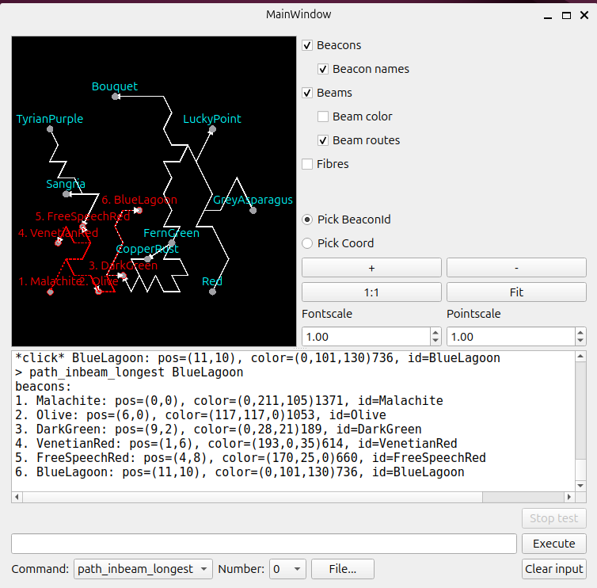

## Beacon datastucture
```
mkdir build && cd "$_"
cmake .. -DGUI=ON
cmake --build .
./beacon_program
```

### Methods:
- add beacons
- add light beam (beacon_i -> beacon_j)
- add fibre (vertex_i -> vertex_j)
- beacons_alphabetically
- beacons_brightness_increasing
- find_beacons {name}
- path_outbeam {id}
- path_inbeam_longest {id}
- route_any {vertex_i} {vertex_j}
- route_least_xpoints {vertex_i} {vertex_j}
- route_fastest {vertex_i} {vertex_j}
- route_fibre_cycle {vertex_i}
## Screenshot

